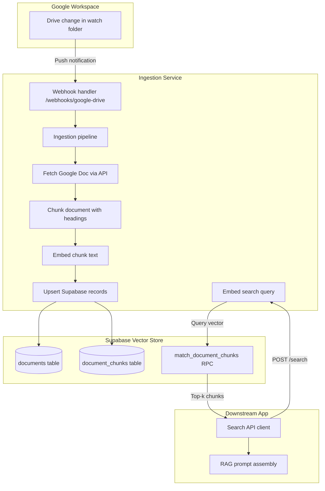

# Service Flow Diagram

```mermaid
flowchart TD
  subgraph GoogleWorkspace[Google Workspace]
    DriveChange["Drive change in watch folder"]
  end

  subgraph IngestionService[Ingestion Service]
    Webhook["Webhook handler /webhooks/google-drive"]
    Pipeline["Ingestion pipeline"]
    FetchDoc["Fetch Google Doc via API"]
    ChunkDoc["Chunk document with headings"]
    EmbedChunks["Embed chunk text"]
    UpsertData["Upsert Supabase records"]
    QueryEmbed["Embed search query"]
  end

  subgraph Supabase[Supabase Vector Store]
    DocsTable[("documents table")]
    ChunksTable[("document_chunks table")]
    MatchFn["match_document_chunks RPC"]
  end

  subgraph Consumer[Downstream App]
    SearchClient["Search API client"]
    RAG["RAG prompt assembly"]
  end

  DriveChange -->|"Push notification"| Webhook
  Webhook --> Pipeline --> FetchDoc --> ChunkDoc --> EmbedChunks --> UpsertData
  UpsertData --> DocsTable
  UpsertData --> ChunksTable

  SearchClient -->|"POST /search"| QueryEmbed
  QueryEmbed -->|"Query vector"| MatchFn
  MatchFn -->|"Top-k chunks"| SearchClient --> RAG
```

> **Tip:** View this diagram with a Mermaid-compatible renderer (e.g., GitHub, GitLab, VS Code Mermaid extension) for the best experience.
